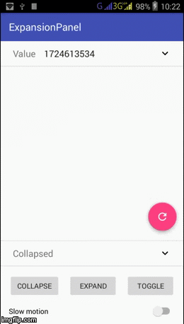

[](https://jitpack.io/#P3tr0viCh/ExpansionPanel)
[](https://android-arsenal.com/api?level=21)

# ExpansionPanel
Animated expansion panel.




Usage
-----
**Add Gradle dependency**

Add the following to your `build.gradle`:
 ```gradle
repositories {
	    ...
	    maven { url "https://jitpack.io" }
}

dependencies {
	    compile 'com.github.P3tr0viCh:ExpansionPanel:2.0.0'
}
```
